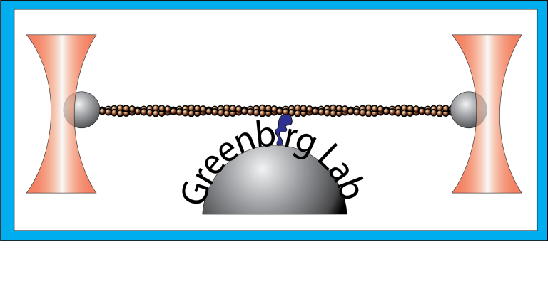

# Project Archive
 
 **Single molecule mechanics and kinetics of cardiac myosin interacting with regulated thin filaments**
 
 
 
 *Sarah R. Clippinger Schulte, Brent Scott, Samantha Barrick, W. Tom Stump, Thomas Blackwell, Michael J. Greenberg*
 
 This repository contains the data and code necessary to reproduce the figures and related analyses in the above publication. Due to GitHub storage limits all trapping files above 100 MB have been compressed into `.zip` arhives. You will have to manually unzip them to load the raw data in SPASM or execute any scripts that calls them. 
 
 Due to large size of the motility videos all raw `.ome.tif` videos generated from Micro Manager have been git ignored. However, exported animated `.apng` (animated png) and `.mkv` versions are available in the repository. Shell scripts (`.sh`) that were used to crop, label, and arrange the motility mosaic video are contained within the `/code` directory.
 
 The version of FIJI used to analyze motility is in the `/fiji` directory which includes the MTrackJ plugins. The subdirectory contains a `default.nix` which can be used to build a Nix derivation so FIJI can find the plugins. The compressed archive (.tar.gz) of all the FIJI contents has been git ignored due to the archive size exceeding the GitHub 100 MB limit. 
 
This repository's `/code` subdirectory is a Nix Flake. You can run `nix develop github:GreenbergLab/2023-thin-filament-trapping?dir=code` to build the development environment used to perform the analyses and generate the figures.

 
